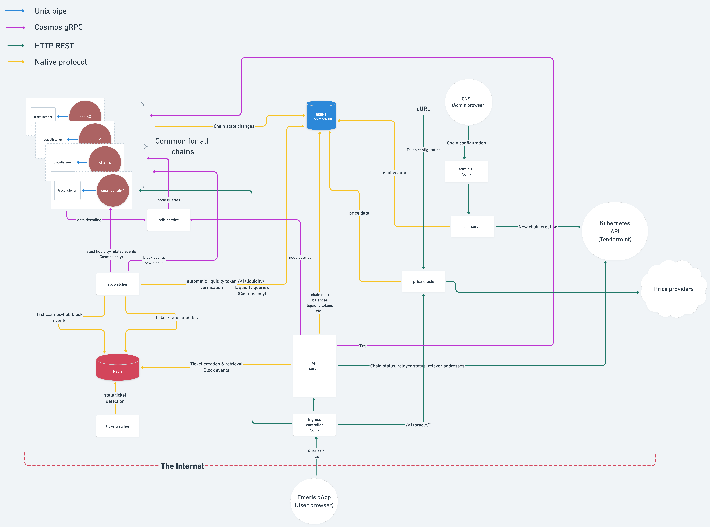

[](https://github.com/allinbits/demeris-backend/actions/workflows/docker-build.yml)

# Emeris Backend

## Intro to Emeris

The following blog posts give a good, high-level overview of the product's vision. 

* [What is Emeris](https://medium.com/emeris-blog/introducing-emeris-the-cross-chain-portal-to-all-crypto-apps-4e6eee5b53a8)
* [Why Emeris matters](https://blog.cosmos.network/why-emeris-matters-to-cosmos-f8f1dfc7664f)

## Architecture

The Emeris backend can be summarised as *a multi-blockchain indexer*. 

  
> Original diagram is [here](https://whimsical.com/backend-current-CP9C1GXs79j9CNs8XAnWJb)

## Components

* [api-server](./api)
* [cns-server](./cns)
* [price-oracle](./price-oracle)
* [rpc-watcher](./rpcwatcher)
* [trace-listener](https://github.com/allinbits/tracelistener/)
* [ticket-watcher](./cmd/ticket-watcher)
* [sdk-service](https://github.com/allinbits/sdk-service-meta)
* [models](https://github.com/allinbits/demeris-backend-models) (shared library)
* [utils](./utils) (shared library)

## Generating API documentation

To generate the OpenAPI specification document (`swagger.yml`), run:

```shell
make generate-swagger
```

## Compiling

Each compilation target resides under a directory living in `cmd`, for example to build `tracelistener` one would execute:

```shell
make tracelistener
```

To build all the project's binaries, run:

```shell
make
```

By default `make` will produce stripped and optimized binaries.

To build a non-stripped binary with debug symbols, append `DEBUG=true` in your environment or when calling `make`:

```shell
make DEBUG=true
```

Build targets are automatically updated as soon as you create a new directory under `cmd`, no need to modify the
`Makefile` to include them.

## Cleaning

To clean the generated OpenAPI specification and build artifacts, run:

```shell
make clean
```

## Docker

To build Docker images for `cmd` binaries, run from the root of this repository:

```shell
docker build -t [yourbinary]:latest -f Dockerfile.<yourbinary> .^
```

## Local Kubernetes environment

### Requirements

* kubectl
* docker (docker desktop will probably install kubectl)
* helm
* kind

### Usage

Run the script to check how to use it.

```shell
$ ./local-env.sh
Manage demeris local environment

Usage:
  ./local-env.sh [command]

Available Commands:
  up 		 Setup the development environment
  down 		 Tear down the development environment
  connect-sql 	 Connect to database using cockroach built-in SQL Client

Flags:
  -p, --port 	 The local port at which the api will be served
  -n, --cluster-name 	 Kind cluster name
  -b, --build 		 Whether to (re)build docker images
  -h, --help 		 Show this menu
  -m, --monitoring   Setup monitoring infrastructure
```

### Grafana credentials

When monitoring is enabled, Grafana is installed with default credentials and will ask for a password change on first setup. Find below the default credentials

Username: admin

Password: admin
