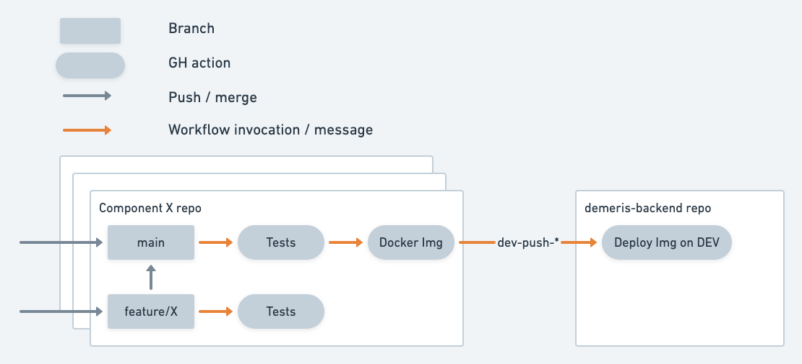

# Emeris Backend

This is the entry-point project for the Emeris backend system.

## Intro to Emeris

The following blog posts give a good, high-level overview of the product's vision. 

* [What is Emeris](https://medium.com/emeris-blog/introducing-emeris-the-cross-chain-portal-to-all-crypto-apps-4e6eee5b53a8)
* [Why Emeris matters](https://blog.cosmos.network/why-emeris-matters-to-cosmos-f8f1dfc7664f)

## Architecture

The Emeris backend can be summarised as *a multi-blockchain indexer*. 

  
> Original diagram is [here](https://whimsical.com/backend-current-CP9C1GXs79j9CNs8XAnWJb)

## Components

* [api-server](https://github.com/allinbits/demeris-api-server)
* [cns-server](https://github.com/allinbits/emeris-cns-server)
* [price-oracle](https://github.com/allinbits/emeris-price-oracle)
* [rpc-watcher](https://github.com/allinbits/emeris-rpcwatcher)
* [trace-listener](https://github.com/allinbits/tracelistener/)
* [ticket-watcher](https://github.com/allinbits/emeris-ticket-watcher)
* [sdk-service](https://github.com/allinbits/sdk-service-meta)
* [models](https://github.com/allinbits/demeris-backend-models) (shared library)
* [utils](./utils) (shared library)

## CI/CD 

The Github actions to deploy to various envs are in the [.github](.github/workflows) subfolder.

The CI/CD workflows are described in the following diagram

Original diagram is [here](https://whimsical.com/ci-cd-HTBa2HjDzroKsePps71hHE)

Each push/merge to a service's `main` branch (which passes testing), creates a Docker image.  
This in turn triggers an automatic deployment to the DEV env. 

## Local Kubernetes environment

We use [Tilt](https://tilt.dev/) to manage our local development   

For more instructions see [this page](https://www.notion.so/allinbits/Emeris-back-end-Dev-environment-setup-2b8a05f940274b45b0b3ba775f1fd6f8#ef44b157a985426d9d9743b5d017e86c).

### Local Grafana credentials

When monitoring is enabled, Grafana is installed with default credentials and will ask for a password change on first setup. Find below the default credentials

Username: admin
Password: admin

## Github secrets

The Github actions of this repo are using the following secrets

| Secret                | Notes                                             | Source                                                |
|-----                  |-----                                              |-----                                                  |
| SLACK_PROD_ALERTS     | Webhook to the `#emeris-alerts` channel           | [Alerts-PROD](https://api.slack.com/apps/A02TZBN7HAN) |
| SLACK_STAGING_ALERTS  | Webhook to the `#emeris-alerts-staging` channel   | [Alerts-Staging](https://api.slack.com/apps/A02TJQD99K9) |
| SLACK_BACKEND_GHN     | Webhook to the `#emeris-backend-ghn` channel      | [Backend-GHN](https://api.slack.com/apps/A03CBCNQ0AW) |
| KUBECONFIG            | DEV K8s cluster configuration                     | - |
| KUBECONFIG_B64        | Dev K8s cluster configuration                     | - |
| KUBECONFIG_STAGING    | Staging K8s cluster configuration                 | - |
| KUBECONFIG_STAGING_B64 | Staging K8s cluster configuration                | - |
| FIXER_KEY             | API key for token fiat prices                     | [CoinLayer API](https://apilayer.com/marketplace) |