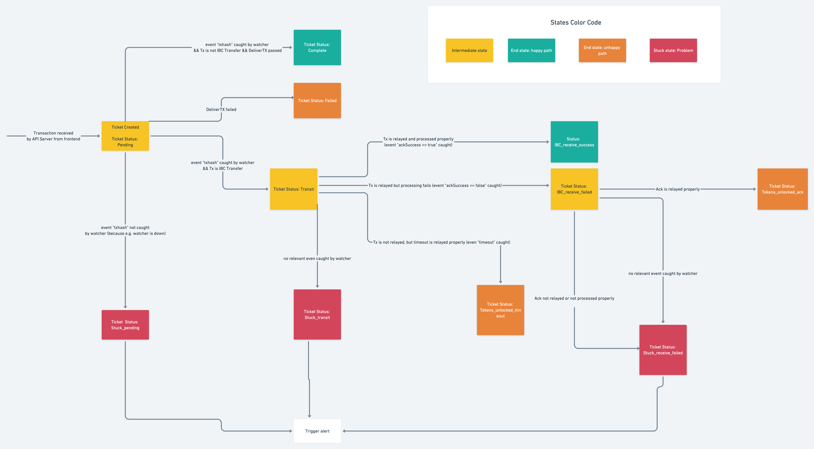

# Ticket watcher

The Ticket watcher helps push *transaction tickets* through their various stages.

## Ticket lifecycle

A ticket represents a blockchain transaction.  
Since transactions are asynchronous, it allows the client to present updates to the end-user.

  
> Original diagram is [here](https://whimsical.com/ticketinglifecycle-WUXezTMhMCeHj4G7YNFywP)